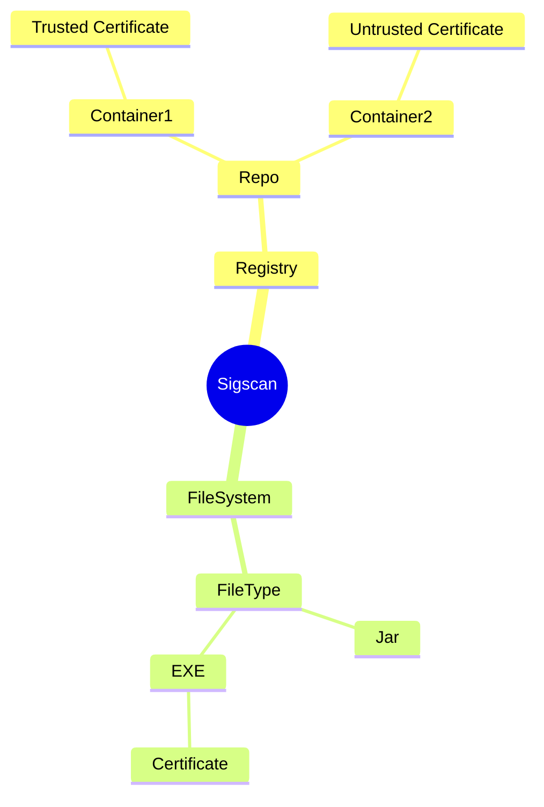

## Gain Better Visibility Into Container Image Signatures

### Introduction

Software supply chains continue to be put in the spotlight.  Kubernetes workloads have been increasing exponentially and the trustworthiness of these workloads is becoming even more important.

There are risks to running untrusted container images as well as having little visibility on how container images were built. Current container image signing tools, such as Sigstore cosign have limited enterprise key management support, and there are no ways to prevent developers from generating local software or even leverage unapproved keys from external key storage providers (e.g. AWS KMS).

### State of the Industry

Container image signing isn't a new concept and it's had it's fair share of growing pains.

Red Hat engineers originally developed Simple Signing to provide a better approach to securely distribute container images.  The challenge was that the Docker image specifiction, when introduced, did not have a cryptographic verification model.  Thankfully the image specifiction evolved to provide an image manifest digest hash value to make for a more consistent verification model.  The Simple Signing approach means that each signature generates a signature claim in the form of a simple json file, one that includes the image manifest digest hash.  Signing involves using the [OpenPGP standard](https://tools.ietf.org/html/rfc4880) to encrypt the signature claim text file with a private key, creating a binary signature file.  To verify an image, the signature claim is decoded using the signer's public key.  If the image manifest digest hash matches you have a high level of certainty that the image from the signer hasn't been modified.  The advantage is that the signature claim files are simple to distribute using a basic web server that relies on standard transport security protocols (e.g. TLS).  The disadvantage is that there isn't a consistent approach to discovering these signature claim files.

Docker Content Trust is another initiative that attempts to solve this problem.  Simple Signing leveraged GPG keys however there are some obvious limitations, especially from an enterprise key management perspective. How does one survive a compromise of signing keys?  Docker fixed this problem by providing a framework called Docker Content Trust.  The engine behind enforcing and managing this trust is [Docker Notary](https://github.com/theupdateframework/notary), a Docker service which is implemented based on [The Update Framework (TUF)](https://theupdateframework.io/).  TUF is a [specification](https://theupdateframework.github.io/specification/latest/) for secure software distribution.  It essentially establishes a trust hierarchy represented by asymmetric keys and metadata.  A timestamp key and target keys provide several security guarantees such as freshness, survivable key compromise, etc.  The challenge is that the Notary service has to be available all the time and provides limited key management capabilities, especially for enterpriese environments.  Basically it only supports local software keypairs and Yubikey, and a custom implementation is required to add additional cryptographic service providers (such as HSMs).  As such, adoption was limited in favor of ad-hoc solutions and the rise of the [Sigstore cosign project](https://github.com/sigstore/cosign) as well as as evolution of the Notary project in the form of NotaryV2.

The [cosign](https://github.com/sigstore/cosign) project started in February 2021 with the goal of making it even easier to sign as well as verify container images.  And the cool thing is that cosign image signatures are stored in OCI registries and can make use of the existing specifications.  It relies on tag-based discovery making it easy for clients to verify signature claims.  Cosign also supports external key management systems such as Hashicorp Vault, AWS KMS, and in particular PKCS#11.  PKCS#11 allows vendors that implement the spec to offload signing operations.  Venafi CodeSign Protect clients support PKCS#11 and it's really easy to [integrate](https://docs.venafi.com/Docs/current/TopNav/Content/CodeSigning/t-codesigning-integration-sigstore.php?tocpath=CodeSign%20Protect%7CIntegrating%20signing%20applications%20with%20CodeSign%20Protect%7C_____7) with cosign.  The cosign project is maturing very quickly as well as adoption given Sigstore popularity and an evolving ecosystem such as Rekor, Fulcio, etc.

[Notary v2](https://github.com/notaryproject/notaryproject#notary-v2-overview) kicked off in December 2019, and throughout 2020 the group agreed on requirements and scenarios.  Like the cosign project, Notary v2 provides for multiple signatures of an OCI artifact to be persisted in an OCI conformant registry.  Artifacts are signed with private keys, and validated with public keys as we would expect.  Notary v2 focuses on signature defintion, registry persistance, discovery and retrieval, and most importantly, a strong focus on keymanagement.  The Notary v2 client (notation) provides a way for 3rd party publishers to leverage a plugin framework to implement custom key management.  This would be similar to how cosign leverages PKCS#11 to offload key management.  Venafi is developing against the notation plugin framework to allow native integration with CodeSign Protect. 

### Introducing SigScan

Sigscan was developed to address the need from the InfoSec teams to have visibility over the identities used to sign container images and artifacts that are stored in OCI registries.  In particular sigscan identifies any image tags that were signed using Sigstore/cosign or NotaryV2, and provides a summary report of the associated code signing certificate identities.

Sigscan was inspired by the work done from the [Jetstack](https://jetstack.io) team around their [Paranoia](https://github.com/jetstack/paranoia) tool to help identify what certificate authorities are present inside any container.

##### Architecture



Any OCI-compliant registry is supported for Sigstore/cosign signatures as well as registries that support OCI artifacts (currently [ACR](https://azure.microsoft.com/en-us/products/container-registry), [ECR](https://aws.amazon.com/ecr/), [oras-project/registry](https://github.com/oras-project/distribution/pkgs/container/registry), and [Zot](https://zotregistry.io))

For Sigstore/cosign signatures we are following the [Signature spec](https://github.com/sigstore/cosign/blob/main/specs/SIGNATURE_SPEC.md) and detecting any optional PEM-encoded x509 certificates.

For OCI Artifacts and NotaryV2 signatures we are following the [Signature Specification](https://github.com/notaryproject/notaryproject/blob/main/specs/signature-specification.md) and detecting any Signature Manifest where artifact type is `application/vnd.cncf.notary.signature`.  From there we are extracting `annotations` that have the `io.cncf.notary.x509chain.thumbprint#S256` metadata.

```shell
$ sigscan repo localhost:5010 --output pretty --insecure
localhost:5010
Path           Digest                                                                   NotaryV2  Sigstore/cosign  
alpine:signed  sha256:a777c9c66ba177ccfea23f2a216ff6721e78a662cd17019488c417135299cd89  ❌         ✅                
alpine:signed  sha256:a777c9c66ba177ccfea23f2a216ff6721e78a662cd17019488c417135299cd89  ❌         ✅                
ubuntu:prod    sha256:31cd7bbfd36421dfd338bceb36d803b3663c1bfa87dfe6af7ba764b5bf34de05  ❌         ✅                
Found 3 signatures out of 4 entries
```

We also support JSON output, in case you want to further inspect the information programmatically.  

```shell
$ sigscan repo localhost:5010 --output json --insecure | jq '.registry.signatures[].subjectname'
"CN=dev.venafidemo.com,OU=Solution Architects,O=Venafi\\, Inc.,L=San Jose,ST=CA,C=US"
"CN=dev.venafidemo.com,OU=Solution Architects,O=Venafi\\, Inc.,L=San Jose,ST=CA,C=US"
```

Essentially with this new level of visibility, you can now see which code signing identities signed container images within a registry.

Sigscan can also be used to scan the filesystem to discover and report on signed JAR as well as EXE files.  Sigscan will extract the signer certificate subjectname as well as the countersigner/timestamp (if available) subjectname.

```shell
$ sigscan fs test/tempdir1 test/tempdir2 --output json | jq
{
  "filesystem": {
    "signatures": [
      {
        "path": "hello-signed.jar",
        "digest": "5aae615b2f60fa7b7b235d698afa2e4e3b9acca26aca157eaa63e1e8458aa4e4",
        "subjectname": "CN=ovf.venafidemo.com,OU=Solution Architects,O=Venafi\\, Inc.,L=San Jose,ST=CA,C=US",
        "countersigner": ""
      },
      {
        "path": "putty.exe",
        "digest": "e3b0c44298fc1c149afbf4c8996fb92427ae41e4649b934ca495991b7852b855",
        "subjectname": "CN=Simon Tatham,O=Simon Tatham,ST=Cambridgeshire,C=GB",
        "countersigner": "CN=Sectigo RSA Time Stamping Signer #3,O=Sectigo Limited,ST=Manchester,C=GB"
      }
    ]
  },
  "directories": "test/tempdir1,test/tempdir2"
}
```

For the full suite of functionality to help gain visibility over your signed container images (and files), see the [Sigscan documentation on GitHub](https://github.com/venafi/sigscan).  Sigscan is fully open source under the Apache 2.0 License, and contributions are welcome!

### Future Work

As we've explained above there are plenty of frameworks for signing container images and artifacts.  While we're somewhat focused on the modern container image signing frameworks, there is room to expand when it comes to getting better visibility about signed artifacts in your environment.  

Here are some potential enhancements:
* Discover artifacts signed using the Simple Signing frameworks.
* Additional filetypes (e.g. XML)
* Discover all signed container images deployed in a Kubernetes cluster.

You can install Sigscan today with `go install`, and it's fully [open source on GitHub](https://github.com/venafi/sigscan).